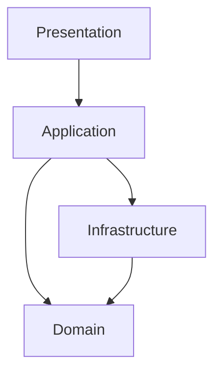

# Architecture

This project has been reorganized following Clean Architecture principles with four layers:

- **domain**: entities, value objects and repository interfaces.
- **application**: use cases orchestrating domain logic.
- **infrastructure**: external adapters such as data sources and network clients.
- **presentation**: Flutter UI and state management with Riverpod.

Each layer depends only on the layer immediately below it and communicates through abstractions defined in the domain.
