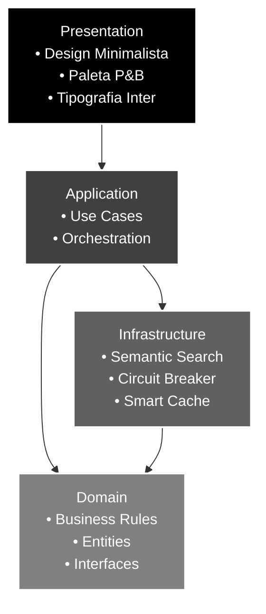
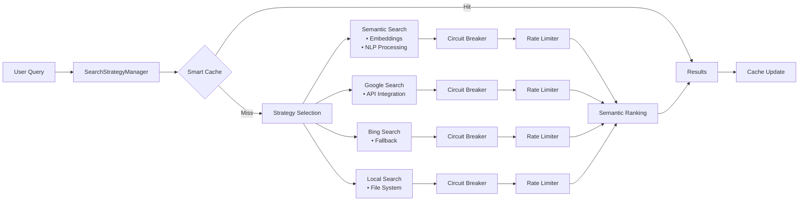

# Arquitetura do Local LLM

Este projeto foi refatorado seguindo princípios de Clean Architecture com quatro camadas bem definidas, implementando um design minimalista e sistema de busca semântica avançado.

## Camadas da Arquitetura

### **Domain** - Camada de Domínio
Contém as regras de negócio puras, independentes de frameworks e tecnologias:
- **Entities**: Modelos de domínio (SearchResult, LlmModel, etc.)
- **Repositories**: Interfaces abstratas para acesso a dados
- **Use Cases**: Casos de uso específicos da aplicação

### **Application** - Camada de Aplicação  
Orquestra os casos de uso e gerencia o fluxo de dados:
- **Use Cases**: GenerateResponse, SearchWeb, ProcessThinkingResponse
- **Orchestration**: Coordenação entre repositórios e serviços

### **Infrastructure** - Camada de Infraestrutura
Implementações concretas de acesso a dados e serviços externos:
- **DataSources**: Conexões com APIs (Ollama, motores de busca)
- **Repositories**: Implementações concretas dos contratos de domínio
- **Core Services**: Circuit breaker, rate limiting, cache inteligente

### **Presentation** - Camada de Apresentação
Interface do usuário com design minimalista:
- **UI Components**: Widgets Flutter com design system minimalista  
- **State Management**: Riverpod para gerenciamento de estado
- **Theme System**: Paleta preto/branco com tipografia Inter



## Sistema de Busca Semântica

### Arquitetura Multi-Engine


### Componentes de Resiliência

#### Circuit Breaker Pattern
- **Estados**: Closed, Open, Half-Open
- **Métricas**: Taxa de falha, timeout, recuperação automática
- **Configuração**: Por estratégia com thresholds específicos

#### Rate Limiting (Token Bucket)
- **Algoritmo**: Token bucket com sliding window
- **Configuração**: Por estratégia (semântica: 20 req/min, APIs: 100 req/min)
- **Fairness**: Distribuição equilibrada de tokens

#### Cache Inteligente
- **Algoritmo**: LRU com scoring multifatorial
- **TTL**: Configurável por tipo de conteúdo  
- **Compressão**: Automática para economia de espaço
- **Métricas**: Hit rate, eviction rate, tamanho

## Design System Minimalista

### Paleta de Cores
```
• Preto Puro:        #000000 (Primary)
• Branco Puro:       #FFFFFF (Background Light)  
• Cinza Escuro:      #404040 (Secondary)
• Cinza Médio:       #606060 (Accent)
• Cinza Claro:       #E8E8E8 (Surface Light)
• Cinza Muito Escuro: #1A1A1A (Card Dark)
```

### Tipografia
- **Font Family**: Inter (sans-serif)
- **Hierarquia**: Display (40px/900) → Headline (24px/700) → Body (16px/400)
- **Line Height**: Generoso (1.75 para body text)
- **Letter Spacing**: Otimizado para legibilidade

### Espaçamento
- **XS**: 4px, **SM**: 8px, **MD**: 16px
- **LG**: 24px, **XL**: 32px, **XXL**: 48px
- **Responsive**: Adaptação automática por breakpoint

## Fluxo de Dados

### Busca Semântica
1. **Query Enhancement**: Expansão de termos e análise de intent
2. **Embedding Generation**: Vetorização usando modelos locais
3. **Multi-Strategy Search**: Execução paralela com fallback
4. **Semantic Ranking**: Score baseado em similaridade vetorial
5. **Cache & Response**: Armazenamento inteligente e retorno

### Integração Ollama
1. **Model Discovery**: Detecção automática de modelos disponíveis
2. **Streaming Response**: Processamento incremental em tempo real  
3. **Error Handling**: Retry automático com exponential backoff
4. **Context Management**: Preservação de contexto conversacional

## Princípios de Design

### Clean Architecture
- Separação rigorosa de responsabilidades
- Inversão de dependências com injeção
- Testabilidade em todas as camadas
- Independência de frameworks

### Minimalismo  
- Remoção de elementos supérfluos
- Foco no conteúdo essencial
- Espaçamento generoso ("breathing room")
- Hierarquia visual através de tipografia

### Performance
- Lazy loading de componentes pesados
- Virtualização de listas extensas  
- Cache inteligente com TTL
- Debounce em operações custosas

Cada camada depende apenas da camada imediatamente abaixo e se comunica através de abstrações definidas no domínio, garantindo baixo acoplamento e alta coesão.
