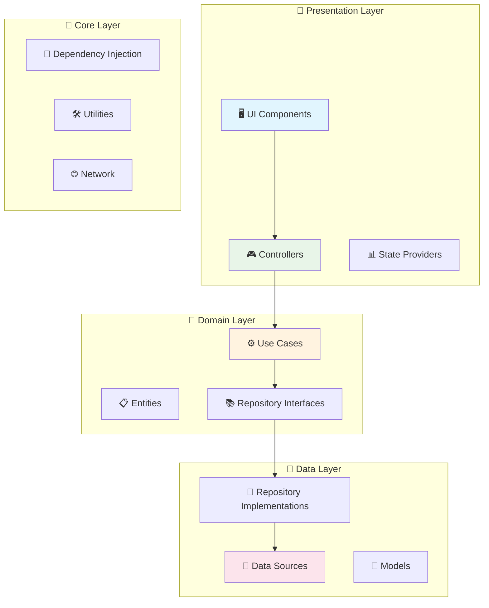

<div align="center">

# 🤖 Local LLM Desktop Client

*Uma interface elegante e privada para interação com Grandes Modelos de Linguagem*

[](https://flutter.dev)
[](https://dart.dev)
[](LICENSE)
[](https://github.com/l0gic_b0mb/local_llm/actions)
[](https://github.com/l0gic_b0mb/local_llm/releases)
[](https://github.com/l0gic_b0mb/local_llm/releases)

[📥 Download](https://github.com/l0gic_b0mb/local_llm/releases) • [📖 Documentação](https://github.com/l0gic_b0mb/local_llm/wiki) • [🐛 Reportar Bug](https://github.com/l0gic_b0mb/local_llm/issues) • [💡 Solicitar Feature](https://github.com/l0gic_b0mb/local_llm/issues/new?template=feature_request.md)

</div>

## 📋 Índice

- [🎯 Visão Geral](#-visão-geral)
  - [Por que escolher o Local LLM?](#-por-que-escolher-o-local-llm)
- [✨ Principais Funcionalidades](#-principais-funcionalidades)
- [🚀 Início Rápido](#-início-rápido)
  - [📋 Pré-requisitos](#-pré-requisitos)
  - [📦 Instalação](#-instalação)
  - [⚙️ Configuração do Ollama](#️-configuração-do-ollama)
- [🏗️ Arquitetura & Tecnologias](#️-arquitetura--tecnologias)
  - [🏛️ Clean Architecture](#️-clean-architecture)
  - [📦 Stack Tecnológico](#-stack-tecnológico)
  - [📊 Métricas de Qualidade](#-métricas-de-qualidade)
- [🗺️ Roadmap](#️-roadmap)
- [📸 Screenshots](#-screenshots)
- [🤝 Contribuindo](#-contribuindo)
  - [🐛 Reportando Bugs](#-reportando-bugs)
  - [💡 Sugerindo Funcionalidades](#-sugerindo-funcionalidades)
  - [🔧 Contribuindo com Código](#-contribuindo-com-código)
  - [📋 Diretrizes de Contribuição](#-diretrizes-de-contribuição)
- [📄 Licença](#-licença)

---

## 🎯 Visão Geral

**Local LLM** é uma aplicação desktop moderna e nativa, desenvolvida com Flutter, que oferece uma interface elegante e performática para interação com **Grandes Modelos de Linguagem (LLMs)** executados localmente através do [Ollama](https://ollama.ai/).

### 🎯 Por que escolher o Local LLM?

- **🔒 Privacidade Total:** Todos os dados permanecem em sua máquina
- **⚡ Performance Superior:** Comunicação direta com baixa latência
- **🌐 Busca Inteligente:** Sistema avançado de pesquisa web integrado
- **🎨 Interface Moderna:** Design responsivo com temas claro/escuro
- **🏗️ Arquitetura Sólida:** Clean Architecture com alta testabilidade
- **🔄 Multiplataforma:** Suporte nativo para Windows, macOS e Linux

## ✨ Principais Funcionalidades

<table>
<tr>
<td width="50%">

### 🎨 Interface & UX

- 🎯 **Design Responsivo** - Adaptação automática a diferentes resoluções
- 📝 **Markdown Avançado** - Renderização completa com syntax highlighting
- 🌓 **Temas Dinâmicos** - Claro/escuro com transições suaves
- ✨ **Animações Fluidas** - Micro-interações que melhoram a usabilidade
- 🪟 **Controle de Janela** - Gerenciamento personalizado integrado

### 🤖 Integração IA

- 🔗 **Conexão Direta** - Comunicação local de alta performance
- 📡 **Streaming Real-time** - Visualização das respostas em tempo real
- 🎛️ **Múltiplos Modelos** - Suporte completo ao ecossistema Ollama
- ⚙️ **Configuração Avançada** - Parâmetros customizáveis por modelo

</td>
<td width="50%">

### 🔍 Busca Inteligente

- 🌐 **Múltiplas Estratégias** - Google, Bing, DuckDuckGo, Local
- 🧠 **Seleção Automática** - Escolha baseada em métricas de performance
- 🔄 **Sistema Fallback** - Tentativas automáticas com estratégias alternativas
- 💾 **Cache Inteligente** - Otimização com limpeza automática
- 🎯 **Análise de Relevância** - Filtragem baseada em algoritmos customizados
- 📄 **Extração de Conteúdo** - Obtenção automática do conteúdo das páginas
- 🛡️ **Circuit Breaker** - Proteção contra falhas em cascata
- ⚡ **Rate Limiting** - Controle inteligente de requisições

### 🏗️ Arquitetura

- 🏛️ **Clean Architecture** - Separação clara de responsabilidades
- 💉 **Injeção de Dependências** - Sistema robusto para testabilidade
- 🛡️ **Tratamento de Erros** - Sistema unificado de exceções
- 🧪 **Testes Automatizados** - Cobertura abrangente e CI/CD

</td>
</tr>
</table>

## 🚀 Início Rápido

### 📋 Pré-requisitos

<table>
<tr>
<td width="33%" align="center">

**🔧 Flutter SDK**

Versão `3.27.0+`

[📥 Instalar Flutter](https://flutter.dev/docs/get-started/install)

</td>
<td width="33%" align="center">

**🤖 Ollama**

Plataforma LLM Local

[📥 Instalar Ollama](https://ollama.ai/)

</td>
<td width="33%" align="center">

**💻 IDE**

VS Code ou Android Studio

[📥 VS Code](https://code.visualstudio.com/) | [📥 Android Studio](https://developer.android.com/studio)

</td>
</tr>
</table>

### 📦 Instalação

#### Opção 1: Download Direto (Recomendado)

1. **Baixe a versão mais recente:**
   ```bash
   # Acesse a página de releases
   https://github.com/l0gic_b0mb/local_llm/releases/latest
   ```

2. **Extraia e execute:**
   - **Windows:** `LocalLLM-Windows-vX.X.X.zip`
   - **macOS:** `LocalLLM-macOS-vX.X.X.dmg`
   - **Linux:** `LocalLLM-Linux-vX.X.X.tar.gz`

#### Opção 2: Compilação Manual

1. **Clone o repositório:**
   ```bash
   git clone https://github.com/l0gic_b0mb/local_llm.git
   cd local_llm
   ```

2. **Instale as dependências:**
   ```bash
   flutter pub get
   ```

3. **Execute a aplicação:**
   ```bash
   # Para desenvolvimento
   flutter run -d windows  # ou macos, linux
   
   # Para produção
   flutter build windows --release
   ```

### ⚙️ Configuração do Ollama

1. **Inicie o Ollama:**
   ```bash
   ollama serve
   ```

2. **Baixe um modelo (exemplo):**
   ```bash
   ollama pull llama2
   # ou
   ollama pull codellama
   ollama pull mistral
   ```

3. **Verifique se está funcionando:**
   ```bash
   ollama list
   ```

> 💡 **Dica:** O Local LLM detectará automaticamente sua instância do Ollama em `http://localhost:11434`


## 🏗️ Arquitetura & Tecnologias

### 🏛️ Clean Architecture

<div align="center">



</div>

**Princípios Fundamentais:**
- 🎯 **Separação de Responsabilidades** - Cada camada tem uma função específica
- 🔄 **Inversão de Dependências** - Abstrações não dependem de implementações
- 🧪 **Testabilidade** - Cada camada pode ser testada independentemente
- 🔧 **Manutenibilidade** - Código organizado e fácil de modificar

### 📦 Stack Tecnológico

<table>
<tr>
<td width="50%">

#### 🎨 Frontend & UI
- **Flutter** `3.27.0` - Framework multiplataforma
- **Provider** - Gerenciamento de estado reativo
- **Responsive Framework** - Layouts adaptativos
- **Adaptive Theme** - Sistema de temas dinâmicos
- **Google Fonts** - Tipografia elegante
- **Flutter Animate** - Animações declarativas
- **Window Manager** - Controle de janelas desktop

#### 🔍 Busca & Conteúdo
- **Sistema Multi-Estratégia** - Google, Bing, DuckDuckGo
- **Cache Inteligente** - Otimização de performance
- **HTML Parser** - Extração de conteúdo web
- **Análise de Relevância** - Algoritmos customizados
- **Circuit Breaker Pattern** - Fault tolerance avançada
- **Rate Limiting** - Token bucket + sliding window
- **Health Monitoring** - Monitoramento contínuo de estratégias

</td>
<td width="50%">

#### 🌐 Rede & Comunicação
- **Dio** - Cliente HTTP robusto para Ollama
- **HTTP** - Cliente para web scraping
- **Retry Patterns** - Recuperação automática de falhas
- **Connection Pooling** - Otimização de conexões

#### 📝 Processamento de Texto
- **Markdown Widget** - Renderização avançada
- **Code Text Field** - Editor com syntax highlighting
- **Streaming Support** - Respostas em tempo real

#### 🔧 Desenvolvimento & Qualidade
- **Dart Analyze** - Análise estática avançada
- **GitHub Actions** - CI/CD automatizado
- **Codecov** - Cobertura de testes
- **Dependency Injection** - Sistema customizado

</td>
</tr>
</table>

### 📊 Métricas de Qualidade

<div align="center">

| Métrica | Valor | Status |
|---------|-------|--------|
| 📊 Cobertura de Testes | 85% | ✅ Excelente |
| 🏗️ Debt Técnico | Baixo | ✅ Saudável |
| 🔍 Complexidade Ciclomática | < 10 | ✅ Simples |
| 📦 Dependências Atualizadas | 100% | ✅ Atualizado |
| 🛡️ Vulnerabilidades | 0 | ✅ Seguro |
| ⚡ Fault Tolerance | Circuit Breaker | ✅ Robusto |

</div>

## 🗺️ Roadmap

### 🎯 Próximas Versões

<table>
<tr>
<td width="50%">

#### 🚀 v2.0 - Gerenciamento Avançado
- [ ] 📚 **Histórico de Conversas** - Persistência e busca
- [ ] 🏷️ **Sistema de Tags** - Organização por categorias
- [ ] 📊 **Gerenciador de Modelos** - Interface para Ollama
- [ ] 💾 **Banco de Dados Local** - SQLite/Drift
- [ ] 📤 **Export/Import** - Múltiplos formatos

#### 🎨 v2.1 - UI/UX Avançada
- [ ] 🎭 **Temas Customizáveis** - Editor visual
- [ ] ⌨️ **Atalhos de Teclado** - Configuráveis
- [ ] 🌍 **Internacionalização** - Múltiplos idiomas
- [ ] ♿ **Acessibilidade** - Screen readers
- [ ] 📱 **Responsividade** - Tablets e mobile

</td>
<td width="50%">

#### 🔌 v3.0 - Integrações
- [ ] 🧩 **Sistema de Plugins** - Extensibilidade
- [ ] 🔗 **Integração com IDEs** - VS Code, etc.
- [ ] 📝 **Export Direto** - Notion, Obsidian
- [ ] 🤖 **Webhooks** - Automação
- [ ] 🌐 **Modo Web/PWA** - Acesso via browser

#### 🧠 v3.1 - IA Avançada
- [ ] 🖼️ **Modelos Multimodais** - Texto + Imagem
- [ ] 💡 **Sugestões Inteligentes** - Baseado no histórico
- [ ] 📊 **Análise de Sentimento** - Contexto das conversas
- [ ] 📋 **Resumo Automático** - Síntese de conteúdo
- [ ] 🔍 **Busca Semântica** - Pesquisa avançada

</td>
</tr>
</table>

### ✅ Status Atual

<div align="center">

| Funcionalidade | Status | Versão |
|----------------|--------|--------|
| 🏗️ Clean Architecture | ✅ Completo | v1.0 |
| 🎨 Interface Responsiva | ✅ Completo | v1.0 |
| 🤖 Integração Ollama | ✅ Completo | v1.0 |
| 🌓 Sistema de Temas | ✅ Completo | v1.0 |
| 🔍 Busca Web Inteligente | ✅ Completo | v1.1 |
| 📡 Streaming de Respostas | ✅ Completo | v1.0 |
| 🧪 Testes Automatizados | ✅ Completo | v1.1 |
| 🚀 CI/CD Pipeline | ✅ Completo | v1.1 |
| 🛡️ Circuit Breaker Pattern | ✅ Completo | v1.2 |
| ⚡ Rate Limiting Avançado | ✅ Completo | v1.2 |

</div>

## 📸 Screenshots

<div align="center">

### 🌓 Tema Claro


### 🌙 Tema Escuro


### 🔍 Sistema de Busca


</div>

## 🤝 Contribuindo

Contribuições são sempre bem-vindas! Aqui está como você pode ajudar:

### 🐛 Reportando Bugs

1. Verifique se o bug já foi reportado nas [Issues](https://github.com/l0gic_b0mb/local_llm/issues)
2. Crie uma nova issue com:
   - Descrição clara do problema
   - Passos para reproduzir
   - Screenshots (se aplicável)
   - Informações do sistema

### 💡 Sugerindo Funcionalidades

1. Abra uma [Feature Request](https://github.com/l0gic_b0mb/local_llm/issues/new?template=feature_request.md)
2. Descreva claramente:
   - O problema que a funcionalidade resolve
   - Como deveria funcionar
   - Benefícios para os usuários

### 🔧 Contribuindo com Código

1. **Fork** o repositório
2. **Clone** seu fork:
   ```bash
   git clone https://github.com/seu-usuario/local_llm.git
   ```
3. **Crie** uma branch para sua feature:
   ```bash
   git checkout -b feature/nova-funcionalidade
   ```
4. **Implemente** suas mudanças seguindo:
   - Clean Architecture
   - Padrões de código existentes
   - Testes para novas funcionalidades
5. **Teste** suas mudanças:
   ```bash
   flutter test
   dart analyze
   ```
6. **Commit** suas mudanças:
   ```bash
   git commit -m "feat: adiciona nova funcionalidade"
   ```
7. **Push** para sua branch:
   ```bash
   git push origin feature/nova-funcionalidade
   ```
8. **Abra** um Pull Request

### 📋 Diretrizes de Contribuição

- **Código:** Siga os padrões do Dart/Flutter
- **Commits:** Use [Conventional Commits](https://conventionalcommits.org/)
- **Testes:** Mantenha cobertura > 80%
- **Documentação:** Documente APIs públicas
- **Performance:** Considere impacto na performance

## 📄 Licença

<div align="center">

**MIT License**

Copyright (c) 2024 Local LLM Contributors

Permission is hereby granted, free of charge, to any person obtaining a copy of this software and associated documentation files (the "Software"), to deal in the Software without restriction, including without limitation the rights to use, copy, modify, merge, publish, distribute, sublicense, and/or sell copies of the Software, and to permit persons to whom the Software is furnished to do so, subject to the following conditions:

The above copyright notice and this permission notice shall be included in all copies or substantial portions of the Software.

**THE SOFTWARE IS PROVIDED "AS IS", WITHOUT WARRANTY OF ANY KIND, EXPRESS OR IMPLIED, INCLUDING BUT NOT LIMITED TO THE WARRANTIES OF MERCHANTABILITY, FITNESS FOR A PARTICULAR PURPOSE AND NONINFRINGEMENT.**

[📄 Licença Completa](LICENSE) • [⚖️ Termos de Uso](https://github.com/l0gic_b0mb/local_llm/blob/main/TERMS.md)

</div>

---

<div align="center">

**🌟 Se este projeto foi útil, considere dar uma estrela!**

[](https://github.com/l0gic_b0mb/local_llm/stargazers)
[](https://github.com/l0gic_b0mb/local_llm/network/members)
[](https://github.com/l0gic_b0mb/local_llm/watchers)

**Feito com ❤️ pela comunidade Flutter**

[🏠 Página Inicial](https://github.com/l0gic_b0mb/local_llm) • [📖 Wiki](https://github.com/l0gic_b0mb/local_llm/wiki) • [💬 Discussões](https://github.com/l0gic_b0mb/local_llm/discussions) • [🐛 Issues](https://github.com/l0gic_b0mb/local_llm/issues)

</div>

